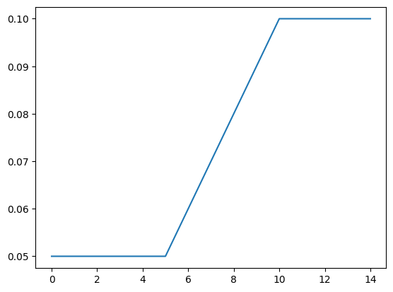

# Table Docs

This notebook provides a full set of examples showing heavylight.Table features.


```python
from heavylight import Table
import numpy as np
import pandas as pd
import seaborn as sns
```

## Example 1: Simple Table

Tables can be created directly from pandas dataframes, or from csv files or excel spreadsheet.

Here we create a dataframe table, with key `x` being an integer key, and floating point values.


```python
df1 = pd.DataFrame({
    'x|int': np.arange(20, 51),
})
df1['value|float'] = df1['x|int'] * 0.04 - 0.03
df1.tail()
```


<div>
<style scoped>
    .dataframe tbody tr th:only-of-type {
        vertical-align: middle;
    }

    .dataframe tbody tr th {
        vertical-align: top;
    }

    .dataframe thead th {
        text-align: right;
    }
</style>
<table border="1" class="dataframe">
  <thead>
    <tr style="text-align: right;">
      <th></th>
      <th>x|int</th>
      <th>value|float</th>
    </tr>
  </thead>
  <tbody>
    <tr>
      <th>26</th>
      <td>46</td>
      <td>1.81</td>
    </tr>
    <tr>
      <th>27</th>
      <td>47</td>
      <td>1.85</td>
    </tr>
    <tr>
      <th>28</th>
      <td>48</td>
      <td>1.89</td>
    </tr>
    <tr>
      <th>29</th>
      <td>49</td>
      <td>1.93</td>
    </tr>
    <tr>
      <th>30</th>
      <td>50</td>
      <td>1.97</td>
    </tr>
  </tbody>
</table>
</div>


We can pass the dataframe in as the contructor to the class.


```python
tab1 = Table(df1)
```

Querying a single value from the table just involves using array `[]` notation.


```python
print(tab1[20])
print(tab1[20] - (20*0.04 - 0.03))
```

    0.77
    0.0


We can query multiple results by passing in a numpy array.  (if not a numpy array then convert first using `np.array`).


```python
x1s = np.array([30, 20, 20, 50])
tab1[x1s]
```


    array([1.17, 0.77, 0.77, 1.97])


## Example 2: String key


```python
df2 = pd.DataFrame(
    {
        'x|str':['A', 'B', 'C'],
        'value|float': [0.3, 0.5, 0.9]
    }
)
df2
```


<div>
<style scoped>
    .dataframe tbody tr th:only-of-type {
        vertical-align: middle;
    }

    .dataframe tbody tr th {
        vertical-align: top;
    }

    .dataframe thead th {
        text-align: right;
    }
</style>
<table border="1" class="dataframe">
  <thead>
    <tr style="text-align: right;">
      <th></th>
      <th>x|str</th>
      <th>value|float</th>
    </tr>
  </thead>
  <tbody>
    <tr>
      <th>0</th>
      <td>A</td>
      <td>0.3</td>
    </tr>
    <tr>
      <th>1</th>
      <td>B</td>
      <td>0.5</td>
    </tr>
    <tr>
      <th>2</th>
      <td>C</td>
      <td>0.9</td>
    </tr>
  </tbody>
</table>
</div>


```python
tab2 = Table(df2)
```


```python
tab2['A']
```


    0.3


```python
tab2['B']
```


    0.5


```python
tab2['AB'] # this should fail?!  Probably because AB is between A and B?  String keys need mapped to unique integers?
```


    0.5


```python
x2s = np.array(['A', 'A', 'C', 'B'])
tab2[x2s]
```


    array([0.3, 0.3, 0.9, 0.5])


```python
# Error if not there (caveat, due to searchsorted intermediate values might not return an error)
try:
    tab2['Z']
except Exception as err:
    print(repr(err))
```

    IndexError('index 3 is out of bounds for axis 0 with size 3')


## Example 3: Banded Key

Often we may want to get a value for a range of inputs, for example if a fee applies to a range of fund values, or reinsurance rates are set by sum assured bands.

We can assign one or more band tables using the `|band` suffix, which specifies the upper bound for that band.

The interval is open on the left, closed on the right, i.e. $(B-1, B]$ with the first band being $[-\infty, B]$.  For an open ended final band, `np.inf` or a significantly high number should be chosen.


```python
df3 = pd.DataFrame({
    'age_to|band': np.array([20, 30, 40, 60, 90, 130, np.inf]),
})
df3['value|str'] = df3['age_to|band'].map(lambda i: f'age_to_{i:03.0f}')
df3
```


<div>
<style scoped>
    .dataframe tbody tr th:only-of-type {
        vertical-align: middle;
    }

    .dataframe tbody tr th {
        vertical-align: top;
    }

    .dataframe thead th {
        text-align: right;
    }
</style>
<table border="1" class="dataframe">
  <thead>
    <tr style="text-align: right;">
      <th></th>
      <th>age_to|band</th>
      <th>value|str</th>
    </tr>
  </thead>
  <tbody>
    <tr>
      <th>0</th>
      <td>20.0</td>
      <td>age_to_020</td>
    </tr>
    <tr>
      <th>1</th>
      <td>30.0</td>
      <td>age_to_030</td>
    </tr>
    <tr>
      <th>2</th>
      <td>40.0</td>
      <td>age_to_040</td>
    </tr>
    <tr>
      <th>3</th>
      <td>60.0</td>
      <td>age_to_060</td>
    </tr>
    <tr>
      <th>4</th>
      <td>90.0</td>
      <td>age_to_090</td>
    </tr>
    <tr>
      <th>5</th>
      <td>130.0</td>
      <td>age_to_130</td>
    </tr>
    <tr>
      <th>6</th>
      <td>inf</td>
      <td>age_to_inf</td>
    </tr>
  </tbody>
</table>
</div>


Create a table (again, passing the dataframe in is sufficient)


```python
tab3 = Table(df3)
```

We can look up any floating point value, and it will return the band it is contained within:


```python
tab3[18.5]
```


    'age_to_020'


```python
tab3[20]
```


    'age_to_020'


```python
tab3[20.00000001]
```


    'age_to_030'


```python
# there is no lower bound (generally because the bands will be currency)
tab3[-5]
```


    'age_to_020'


```python
# there is an upper bound, and will error if over this
try:
    print(tab3[131])
except Exception as err:
    print(repr(err))
```

    age_to_inf


```python
x3s = np.linspace(35, 45, 14)
pd.DataFrame({'x3s':x3s, 'result':tab3[x3s]})
```


<div>
<style scoped>
    .dataframe tbody tr th:only-of-type {
        vertical-align: middle;
    }

    .dataframe tbody tr th {
        vertical-align: top;
    }

    .dataframe thead th {
        text-align: right;
    }
</style>
<table border="1" class="dataframe">
  <thead>
    <tr style="text-align: right;">
      <th></th>
      <th>x3s</th>
      <th>result</th>
    </tr>
  </thead>
  <tbody>
    <tr>
      <th>0</th>
      <td>35.000000</td>
      <td>age_to_040</td>
    </tr>
    <tr>
      <th>1</th>
      <td>35.769231</td>
      <td>age_to_040</td>
    </tr>
    <tr>
      <th>2</th>
      <td>36.538462</td>
      <td>age_to_040</td>
    </tr>
    <tr>
      <th>3</th>
      <td>37.307692</td>
      <td>age_to_040</td>
    </tr>
    <tr>
      <th>4</th>
      <td>38.076923</td>
      <td>age_to_040</td>
    </tr>
    <tr>
      <th>5</th>
      <td>38.846154</td>
      <td>age_to_040</td>
    </tr>
    <tr>
      <th>6</th>
      <td>39.615385</td>
      <td>age_to_040</td>
    </tr>
    <tr>
      <th>7</th>
      <td>40.384615</td>
      <td>age_to_060</td>
    </tr>
    <tr>
      <th>8</th>
      <td>41.153846</td>
      <td>age_to_060</td>
    </tr>
    <tr>
      <th>9</th>
      <td>41.923077</td>
      <td>age_to_060</td>
    </tr>
    <tr>
      <th>10</th>
      <td>42.692308</td>
      <td>age_to_060</td>
    </tr>
    <tr>
      <th>11</th>
      <td>43.461538</td>
      <td>age_to_060</td>
    </tr>
    <tr>
      <th>12</th>
      <td>44.230769</td>
      <td>age_to_060</td>
    </tr>
    <tr>
      <th>13</th>
      <td>45.000000</td>
      <td>age_to_060</td>
    </tr>
  </tbody>
</table>
</div>


## Example 4: Bounded Integer

If we are dealing with integer keys, sometimes we want the last key to be used for all higher values, for example in a mortality table with a 5 year select period, for durations 5+ we want to use the 5 year duration rate.  This can be accomplished by specifying the key column as a bounded integer: `|int_bound`.  When specified, this applies both on the lower and upper bounds.


```python
df4 = pd.DataFrame({
    'term|int_bound': [5, 6, 7, 8, 9, 10],
    'rate': [0.05, 0.06, 0.07, 0.08, 0.09, 0.1],
})
df4
```


<div>
<style scoped>
    .dataframe tbody tr th:only-of-type {
        vertical-align: middle;
    }

    .dataframe tbody tr th {
        vertical-align: top;
    }

    .dataframe thead th {
        text-align: right;
    }
</style>
<table border="1" class="dataframe">
  <thead>
    <tr style="text-align: right;">
      <th></th>
      <th>term|int_bound</th>
      <th>rate</th>
    </tr>
  </thead>
  <tbody>
    <tr>
      <th>0</th>
      <td>5</td>
      <td>0.05</td>
    </tr>
    <tr>
      <th>1</th>
      <td>6</td>
      <td>0.06</td>
    </tr>
    <tr>
      <th>2</th>
      <td>7</td>
      <td>0.07</td>
    </tr>
    <tr>
      <th>3</th>
      <td>8</td>
      <td>0.08</td>
    </tr>
    <tr>
      <th>4</th>
      <td>9</td>
      <td>0.09</td>
    </tr>
    <tr>
      <th>5</th>
      <td>10</td>
      <td>0.10</td>
    </tr>
  </tbody>
</table>
</div>


```python
tab4 = Table(df4)
```


```python
x4s = np.arange(0, 15)
sns.lineplot(x=x4s, y=tab4[x4s], markers=True)
```


    <Axes: >


    

    


## Example 5: Two keys are better than one

Tables often have multiple dimensions, e.g. Income Protection recovery rates vary by age, duration etc.  `Table` deals with these the same way as the one dimensional case.


```python
df5 = pd.DataFrame({
    'age|int_bound': np.tile(np.arange(20, 41), 5),
    'dur|int_bound': np.repeat(np.arange(1, 6), (41-20))
})
df5['values'] = df5['age|int_bound'] * 0.01 + 1.32 ** df5['dur|int_bound']
df5
```


<div>
<style scoped>
    .dataframe tbody tr th:only-of-type {
        vertical-align: middle;
    }

    .dataframe tbody tr th {
        vertical-align: top;
    }

    .dataframe thead th {
        text-align: right;
    }
</style>
<table border="1" class="dataframe">
  <thead>
    <tr style="text-align: right;">
      <th></th>
      <th>age|int_bound</th>
      <th>dur|int_bound</th>
      <th>values</th>
    </tr>
  </thead>
  <tbody>
    <tr>
      <th>0</th>
      <td>20</td>
      <td>1</td>
      <td>1.520000</td>
    </tr>
    <tr>
      <th>1</th>
      <td>21</td>
      <td>1</td>
      <td>1.530000</td>
    </tr>
    <tr>
      <th>2</th>
      <td>22</td>
      <td>1</td>
      <td>1.540000</td>
    </tr>
    <tr>
      <th>3</th>
      <td>23</td>
      <td>1</td>
      <td>1.550000</td>
    </tr>
    <tr>
      <th>4</th>
      <td>24</td>
      <td>1</td>
      <td>1.560000</td>
    </tr>
    <tr>
      <th>...</th>
      <td>...</td>
      <td>...</td>
      <td>...</td>
    </tr>
    <tr>
      <th>100</th>
      <td>36</td>
      <td>5</td>
      <td>4.367464</td>
    </tr>
    <tr>
      <th>101</th>
      <td>37</td>
      <td>5</td>
      <td>4.377464</td>
    </tr>
    <tr>
      <th>102</th>
      <td>38</td>
      <td>5</td>
      <td>4.387464</td>
    </tr>
    <tr>
      <th>103</th>
      <td>39</td>
      <td>5</td>
      <td>4.397464</td>
    </tr>
    <tr>
      <th>104</th>
      <td>40</td>
      <td>5</td>
      <td>4.407464</td>
    </tr>
  </tbody>
</table>
<p>105 rows × 3 columns</p>
</div>


```python
tab5 = Table(df5)
```

We can lookup the keys by passing in comma separated values


```python
tab5[104, 40]
```


    4.4074642432000015


Like the one dimensional case, we can pass in numpy arrays of values to each key, to obtain an array of results:


```python
x5_age = np.array([20, 20, 40, 30, 0, 9999])
x5_dur = np.array([1, 2, 3, 5, -2, 9999])
tab5[x5_age, x5_dur]
```


    array([1.52      , 1.9424    , 2.699968  , 4.30746424, 1.52      ,
           4.40746424])


## Example 6: Error: Tables need to be complete

If using more than one dimension, the table needs to be complete, i.e. len(key 1) x len(key 2) x len(key 3) == len(table).

This is tested at table construction time.


```python
df6 = pd.DataFrame({
    'k1|int': [1,2,3,4, 1,2],
    'k2|str': list('AAAABB'),
    'values': [1, 2, 3, 4, 11, 22]
})
df6
```


<div>
<style scoped>
    .dataframe tbody tr th:only-of-type {
        vertical-align: middle;
    }

    .dataframe tbody tr th {
        vertical-align: top;
    }

    .dataframe thead th {
        text-align: right;
    }
</style>
<table border="1" class="dataframe">
  <thead>
    <tr style="text-align: right;">
      <th></th>
      <th>k1|int</th>
      <th>k2|str</th>
      <th>values</th>
    </tr>
  </thead>
  <tbody>
    <tr>
      <th>0</th>
      <td>1</td>
      <td>A</td>
      <td>1</td>
    </tr>
    <tr>
      <th>1</th>
      <td>2</td>
      <td>A</td>
      <td>2</td>
    </tr>
    <tr>
      <th>2</th>
      <td>3</td>
      <td>A</td>
      <td>3</td>
    </tr>
    <tr>
      <th>3</th>
      <td>4</td>
      <td>A</td>
      <td>4</td>
    </tr>
    <tr>
      <th>4</th>
      <td>1</td>
      <td>B</td>
      <td>11</td>
    </tr>
    <tr>
      <th>5</th>
      <td>2</td>
      <td>B</td>
      <td>22</td>
    </tr>
  </tbody>
</table>
</div>


```python
# This will trigger an assertion error (to fix:should raise a proper Exception)

try:
    tab6 = Table(df6)
except Exception as err:
    print(repr(err))
```

    ValueError('Input `df` is not rectangular, expected_rows=8 != len(self.values)=6')


## Example 7: External tables (CSO)


```python
csv7_src = 'example_tables/2017_loaded_CSO_mortality_rates_heavytable.csv'
df7 = pd.read_csv(csv7_src)
df7 = df7.drop(columns=['Age|int'])
df7
```


<div>
<style scoped>
    .dataframe tbody tr th:only-of-type {
        vertical-align: middle;
    }

    .dataframe tbody tr th {
        vertical-align: top;
    }

    .dataframe thead th {
        text-align: right;
    }
</style>
<table border="1" class="dataframe">
  <thead>
    <tr style="text-align: right;">
      <th></th>
      <th>IssueAge|int</th>
      <th>Duration|int</th>
      <th>Underwriting|str</th>
      <th>Sex|str</th>
      <th>vals</th>
    </tr>
  </thead>
  <tbody>
    <tr>
      <th>0</th>
      <td>18</td>
      <td>1</td>
      <td>NS_P</td>
      <td>Female</td>
      <td>0.00033</td>
    </tr>
    <tr>
      <th>1</th>
      <td>18</td>
      <td>2</td>
      <td>NS_P</td>
      <td>Female</td>
      <td>0.00033</td>
    </tr>
    <tr>
      <th>2</th>
      <td>18</td>
      <td>3</td>
      <td>NS_P</td>
      <td>Female</td>
      <td>0.00033</td>
    </tr>
    <tr>
      <th>3</th>
      <td>18</td>
      <td>4</td>
      <td>NS_P</td>
      <td>Female</td>
      <td>0.00033</td>
    </tr>
    <tr>
      <th>4</th>
      <td>18</td>
      <td>5</td>
      <td>NS_P</td>
      <td>Female</td>
      <td>0.00033</td>
    </tr>
    <tr>
      <th>...</th>
      <td>...</td>
      <td>...</td>
      <td>...</td>
      <td>...</td>
      <td>...</td>
    </tr>
    <tr>
      <th>53555</th>
      <td>118</td>
      <td>2</td>
      <td>S_R</td>
      <td>Male</td>
      <td>0.94856</td>
    </tr>
    <tr>
      <th>53556</th>
      <td>118</td>
      <td>3</td>
      <td>S_R</td>
      <td>Male</td>
      <td>1.00000</td>
    </tr>
    <tr>
      <th>53557</th>
      <td>119</td>
      <td>1</td>
      <td>S_R</td>
      <td>Male</td>
      <td>0.94856</td>
    </tr>
    <tr>
      <th>53558</th>
      <td>119</td>
      <td>2</td>
      <td>S_R</td>
      <td>Male</td>
      <td>1.00000</td>
    </tr>
    <tr>
      <th>53559</th>
      <td>120</td>
      <td>1</td>
      <td>S_R</td>
      <td>Male</td>
      <td>1.00000</td>
    </tr>
  </tbody>
</table>
<p>53560 rows × 5 columns</p>
</div>


```python
len(df7['IssueAge|int'].unique()) * len(df7['Duration|int'].unique()) * len(df7['Underwriting|str'].unique()) * len(df7['Sex|str'].unique())
```


    106090


```python
for col in df7:
    print(df7[col].value_counts())
```

    IssueAge|int
    18     1030
    19     1020
    20     1010
    21     1000
    22      990
           ... 
    116      50
    117      40
    118      30
    119      20
    120      10
    Name: count, Length: 103, dtype: int64
    Duration|int
    1      1030
    2      1020
    3      1010
    4      1000
    5       990
           ... 
    99       50
    100      40
    101      30
    102      20
    103      10
    Name: count, Length: 103, dtype: int64
    Underwriting|str
    NS_P     10712
    NS_R     10712
    NS_SP    10712
    S_P      10712
    S_R      10712
    Name: count, dtype: int64
    Sex|str
    Female    26780
    Male      26780
    Name: count, dtype: int64
    vals
    1.00000    1030
    0.94856     510
    0.94780     510
    0.89977     505
    0.89833     505
               ... 
    0.02581       1
    0.02956       1
    0.01209       1
    0.02202       1
    0.17419       1
    Name: count, Length: 4579, dtype: int64


### We need to make the dataframe rectangular, i.e. Age|int and Duration|int need populated with the missing values

The `rectify` method in Table can do this.


```python
tab7 = Table(Table.rectify(df7))
```


```python
# run some tests on this

df7_test = df7.sample(n=100_000, replace=True)
df7_test
```


<div>
<style scoped>
    .dataframe tbody tr th:only-of-type {
        vertical-align: middle;
    }

    .dataframe tbody tr th {
        vertical-align: top;
    }

    .dataframe thead th {
        text-align: right;
    }
</style>
<table border="1" class="dataframe">
  <thead>
    <tr style="text-align: right;">
      <th></th>
      <th>IssueAge|int</th>
      <th>Duration|int</th>
      <th>Underwriting|str</th>
      <th>Sex|str</th>
      <th>vals</th>
    </tr>
  </thead>
  <tbody>
    <tr>
      <th>34195</th>
      <td>40</td>
      <td>25</td>
      <td>S_P</td>
      <td>Female</td>
      <td>0.01299</td>
    </tr>
    <tr>
      <th>5669</th>
      <td>21</td>
      <td>8</td>
      <td>NS_P</td>
      <td>Male</td>
      <td>0.00051</td>
    </tr>
    <tr>
      <th>14683</th>
      <td>68</td>
      <td>47</td>
      <td>NS_R</td>
      <td>Female</td>
      <td>0.72494</td>
    </tr>
    <tr>
      <th>36976</th>
      <td>89</td>
      <td>13</td>
      <td>S_P</td>
      <td>Female</td>
      <td>0.35742</td>
    </tr>
    <tr>
      <th>27879</th>
      <td>29</td>
      <td>22</td>
      <td>NS_SP</td>
      <td>Male</td>
      <td>0.00163</td>
    </tr>
    <tr>
      <th>...</th>
      <td>...</td>
      <td>...</td>
      <td>...</td>
      <td>...</td>
      <td>...</td>
    </tr>
    <tr>
      <th>28284</th>
      <td>33</td>
      <td>65</td>
      <td>NS_SP</td>
      <td>Male</td>
      <td>0.28269</td>
    </tr>
    <tr>
      <th>41572</th>
      <td>70</td>
      <td>51</td>
      <td>S_P</td>
      <td>Male</td>
      <td>1.00000</td>
    </tr>
    <tr>
      <th>10090</th>
      <td>86</td>
      <td>9</td>
      <td>NS_P</td>
      <td>Male</td>
      <td>0.22817</td>
    </tr>
    <tr>
      <th>17779</th>
      <td>36</td>
      <td>11</td>
      <td>NS_R</td>
      <td>Male</td>
      <td>0.00118</td>
    </tr>
    <tr>
      <th>10862</th>
      <td>19</td>
      <td>48</td>
      <td>NS_R</td>
      <td>Female</td>
      <td>0.00722</td>
    </tr>
  </tbody>
</table>
<p>100000 rows × 5 columns</p>
</div>


```python
df7_test['val_from_tab7'] = tab7[
     df7_test['IssueAge|int'].values,
     df7_test['Duration|int'].values,
     df7_test['Underwriting|str'].values,
     df7_test['Sex|str'].values]
df7_test
```


<div>
<style scoped>
    .dataframe tbody tr th:only-of-type {
        vertical-align: middle;
    }

    .dataframe tbody tr th {
        vertical-align: top;
    }

    .dataframe thead th {
        text-align: right;
    }
</style>
<table border="1" class="dataframe">
  <thead>
    <tr style="text-align: right;">
      <th></th>
      <th>IssueAge|int</th>
      <th>Duration|int</th>
      <th>Underwriting|str</th>
      <th>Sex|str</th>
      <th>vals</th>
      <th>val_from_tab7</th>
    </tr>
  </thead>
  <tbody>
    <tr>
      <th>34195</th>
      <td>40</td>
      <td>25</td>
      <td>S_P</td>
      <td>Female</td>
      <td>0.01299</td>
      <td>0.01299</td>
    </tr>
    <tr>
      <th>5669</th>
      <td>21</td>
      <td>8</td>
      <td>NS_P</td>
      <td>Male</td>
      <td>0.00051</td>
      <td>0.00051</td>
    </tr>
    <tr>
      <th>14683</th>
      <td>68</td>
      <td>47</td>
      <td>NS_R</td>
      <td>Female</td>
      <td>0.72494</td>
      <td>0.72494</td>
    </tr>
    <tr>
      <th>36976</th>
      <td>89</td>
      <td>13</td>
      <td>S_P</td>
      <td>Female</td>
      <td>0.35742</td>
      <td>0.35742</td>
    </tr>
    <tr>
      <th>27879</th>
      <td>29</td>
      <td>22</td>
      <td>NS_SP</td>
      <td>Male</td>
      <td>0.00163</td>
      <td>0.00163</td>
    </tr>
    <tr>
      <th>...</th>
      <td>...</td>
      <td>...</td>
      <td>...</td>
      <td>...</td>
      <td>...</td>
      <td>...</td>
    </tr>
    <tr>
      <th>28284</th>
      <td>33</td>
      <td>65</td>
      <td>NS_SP</td>
      <td>Male</td>
      <td>0.28269</td>
      <td>0.28269</td>
    </tr>
    <tr>
      <th>41572</th>
      <td>70</td>
      <td>51</td>
      <td>S_P</td>
      <td>Male</td>
      <td>1.00000</td>
      <td>1.00000</td>
    </tr>
    <tr>
      <th>10090</th>
      <td>86</td>
      <td>9</td>
      <td>NS_P</td>
      <td>Male</td>
      <td>0.22817</td>
      <td>0.22817</td>
    </tr>
    <tr>
      <th>17779</th>
      <td>36</td>
      <td>11</td>
      <td>NS_R</td>
      <td>Male</td>
      <td>0.00118</td>
      <td>0.00118</td>
    </tr>
    <tr>
      <th>10862</th>
      <td>19</td>
      <td>48</td>
      <td>NS_R</td>
      <td>Female</td>
      <td>0.00722</td>
      <td>0.00722</td>
    </tr>
  </tbody>
</table>
<p>100000 rows × 6 columns</p>
</div>


```python
np.allclose(df7_test['vals'], df7_test['val_from_tab7'])
```


    True


We can also specify a different fill value for missing values, using `fill`.  The default is `np.nan`


```python
tab7b = Table(Table.rectify(df7, fill=-1))   # np.nan is the default fill
```


```python
tab7b[
     df7_test['IssueAge|int'].values,
     df7_test['Duration|int'].values,
     df7_test['Underwriting|str'].values,
     df7_test['Sex|str'].values
]
```


    array([1.2990e-02, 5.1000e-04, 7.2494e-01, ..., 2.2817e-01, 1.1800e-03,
           7.2200e-03])


```python
tab7b[2, 2, 'NS_P', 'Female']  # This should fail, but because the value exists for a different key, it passes.
```


    0.45219


```python
df7['IssueAge|int'].describe()
```


    count    53560.00000
    mean        52.00000
    std         24.39285
    min         18.00000
    25%         31.00000
    50%         48.00000
    75%         69.00000
    max        120.00000
    Name: IssueAge|int, dtype: float64


```python

```
